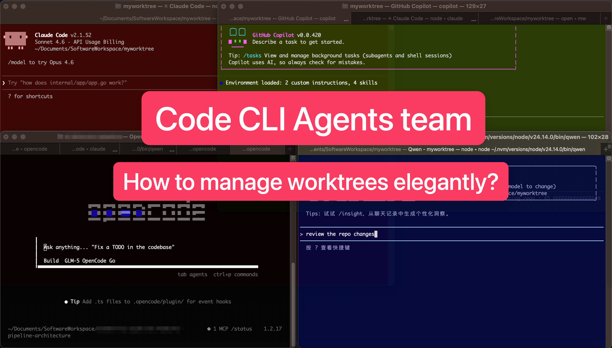
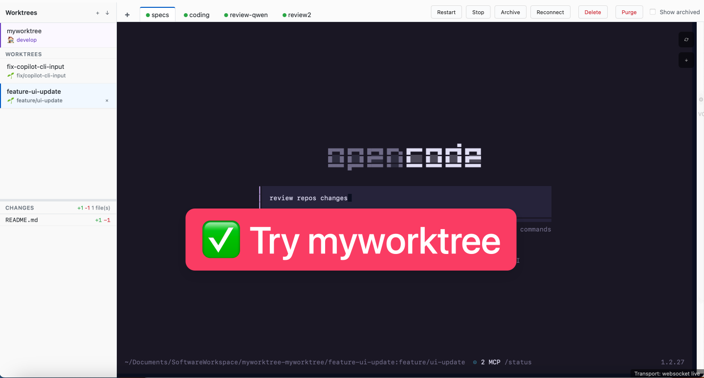

# myworktree

A lightweight agents team management tool: fully leveraging the independent workspace feature of git worktree, diversifying the capabilities of coding CLI instances (long-running processes), and providing a minimal viable Web UI and output playback.

- 中文说明: [README.zh-CN.md](./README.zh-CN.md)
- Docs: [PRD](./docs/PRD.md) · [Architecture](./docs/ARCHITECTURE.md) · [API](./docs/API.md)






## Background & pain points
When you’re juggling multiple coding tasks in the same repo (often with multiple AI coding CLIs collaborating/reviewing each other), it’s easy to end up with:
- One working directory polluted by half-finished changes, dependency installs, and temporary scripts
- Too many terminals to track (build/test/search/review), with no single place to see what’s still running
- Long-running CLI processes that die when you close a window, or that you can’t easily reattach to later

A common workflow looks like: GPT/GLM drafts docs, Claude/MiniMax implements changes, and Qwen does review — which works best when each “role” has an isolated workspace and a persistent, re-attachable terminal.

## What myworktree does
myworktree is a thin management layer that:
- Uses **git worktrees** to give each task an isolated directory (and typically a dedicated branch)
- Runs multiple managed **instances** per worktree and keeps them alive on the backend
- Provides a minimal Web UI to list worktrees/instances and **replay/follow output**
- Supports **Tag** templates (`command/env/preStart/cwd`) to start instances with the right setup, without baking project-specific logic into the manager

## Features (MVP)
- Create/list/import/delete managed worktrees (strict delete: refuses if dirty)
- Start/list/stop managed instances per worktree via **Tag** templates
- Instance restart support (keeps worktree/tag-or-command/labels and links old/new instance records)
- Optional instance labels (`k=v`) with UI filtering/search
- Web UI can be closed/reopened; instances keep running; WebSocket Web TTY is default (with SSE/HTTP fallback)
- UI shows transport status (`websocket/sse/polling`) and provides WS reconnect action
- Startup reconcile: stale persisted `running` instances are auto-marked `stopped` after mw restart
- Optional built-in HTTPS (`--tls-cert/--tls-key`) and token auth for non-loopback
- Stored backlog redaction for common secrets (e.g. `sk-...`)
- MCP tool endpoints (`/api/mcp/tools`, `/api/mcp/call`)

## Requirements
- macOS 12+ (other platforms are not validated yet)
- `git`
- `zsh`
- `script` (used to host managed interactive shells)
- Go toolchain to build (no external Go dependencies)

## Quick start

### Release binaries

If you just want to use `myworktree`, download the latest release assets from GitHub Releases:

- Apple Silicon Macs: `myworktree_vX.Y.Z_darwin_arm64.tar.gz`
- Intel Macs: `myworktree_vX.Y.Z_darwin_amd64.tar.gz`
- Integrity file: `checksums.txt`

Example:

```bash
# Pick the archive that matches your Mac, then verify and unpack it.
curl -LO https://github.com/linletian/myworktree/releases/download/v0.1.2/myworktree_v0.1.2_darwin_arm64.tar.gz
curl -LO https://github.com/linletian/myworktree/releases/download/v0.1.2/checksums.txt
shasum -a 256 -c checksums.txt --ignore-missing
tar -xzf myworktree_v0.1.2_darwin_arm64.tar.gz

# Optional: install into PATH
sudo install -m 755 ./mw /usr/local/bin/mw
sudo install -m 755 ./myworktree /usr/local/bin/myworktree

# Verify the downloaded binary
mw --version
```

Start from `v0.1.2` or newer for public release binaries. The earlier `v0.1.0` GitHub Release assets were withdrawn after post-release validation uncovered severe terminal interaction issues, and `v0.1.2` is the current recommended public release.

Each release archive contains `mw`, `myworktree`, `README.md`, `LICENSE`, and `CHANGELOG.md`.
If there is no prerelease/release asset yet, or you need a platform we do not publish, follow the source build steps below.

### Build & install

```bash
# Build (in the myworktree source repo)
cd /path/to/myworktree
go build -o myworktree ./cmd/myworktree

# Optional: build alias command `mw` (equivalent to `myworktree`)
# (`mw` auto-opens browser by default; disable with `-open=false`)
go build -o mw ./cmd/mw
```

Strongly recommended: install built binary into your user/system PATH (example for macOS):

```bash
# Optional: install into PATH (pick ONE approach)
# A) user-local bin
# mkdir -p ~/bin
# mv /path/to/myworktree/myworktree ~/bin/myworktree
# mv /path/to/myworktree/mw ~/bin/mw
# B) system-wide (usually already in PATH)
# NOTE: install expects a *built binary*, not the Go source directory (so NOT cmd/mw).
# cd /path/to/myworktree && go build -o mw ./cmd/mw && go build -o myworktree ./cmd/myworktree
# sudo install -m 755 ./myworktree /usr/local/bin/myworktree
sudo install -m 755 ./mw /usr/local/bin/mw

# Alternative: go install (installs into GOBIN/GOPATH/bin)
# go install ./cmd/mw
# go install ./cmd/myworktree
```

Check the build metadata:

```bash
myworktree --version
mw version
```

### Run

```bash
# Run (inside target git repository)
cd /path/to/target/git/repo

# Run via absolute path if PATH is not configured
# /path/to/myworktree/mw -listen 127.0.0.1:0

# `-listen` is optional; using port `0` means auto-select and persist a repo-bound port.
# For the same repo, future runs will reuse that port when available.
# myworktree prints the full URL with actual port.
# /path/to/myworktree/myworktree -listen 127.0.0.1:0
# /path/to/myworktree/mw -listen 127.0.0.1:0
mw

# Optional: use a fixed port
# /path/to/myworktree/myworktree -listen 127.0.0.1:50053
# /path/to/myworktree/myworktree -open=true
```

When startup succeeds, `mw` opens the web page automatically at the serving URL by default.
`myworktree` prints the URL without opening a browser unless you pass `-open=true`.

myworktree uses the **current working directory** to detect the target repo (git root) and derives an isolated per-project data dir from it, so you can manage other projects by running the same binary in a different repo directory.

By default, newly created worktrees are placed next to your repo:
`<repo-parent>/<repo-name>-myworktree/<worktree-name>/`.
Use `-worktrees-dir=data` to use the legacy location under the per-project data dir, or set `-worktrees-dir` to a custom path.

## CLI examples
```bash
# version
myworktree --version
mw version

# worktrees
myworktree worktree new "fix login 401 and add tests"
myworktree worktree list
myworktree worktree delete <worktreeId>

# tags
myworktree tag list

# instances
myworktree instance start --worktree <worktreeId> --tag <tagId>
myworktree instance start --worktree <worktreeId> --cmd "echo hello && ls"
myworktree instance start --worktree <worktreeId>  # starts an interactive shell instance
myworktree instance list
myworktree instance stop <instanceId>
```

Note: command starts are executed inside the instance shell, and you can continue sending input to the same running instance from the UI.

## Tag config

Tags are loaded from:
- Global: `$(os.UserConfigDir())/myworktree/tags.json`
- Project: `$(os.UserConfigDir())/myworktree/<repoHash>/tags.json`

Example:

```json
{
  "tags": [
    {
      "id": "backend-dev",
      "command": "npm run dev",
      "preStart": "npm install",
      "cwd": "apps/backend",
      "env": {
        "NODE_ENV": "development"
      }
    }
  ]
}
```

## Local testing & CI

Run local checks before opening a PR:

```bash
test -z "$(gofmt -l .)"
go test ./...
go build -o myworktree ./cmd/myworktree
go build -o mw ./cmd/mw
```

GitHub Actions (`.github/workflows/go-ci.yml`) runs on:
- pushes to `develop` and `main`
- pull requests targeting `develop` and `main` (`opened`, `synchronize`, `reopened`, `ready_for_review`)

The workflow verifies `gofmt`, runs `go test ./...`, and builds both binaries on Ubuntu and macOS.

Tagged releases (`v*`) run `.github/workflows/release.yml`, which produces darwin `amd64` / `arm64` archives plus SHA256 checksums.

## Remote access
- Default: binds to loopback only.
- If you listen on a non-loopback address, you must set `--auth`.
- For HTTPS, provide `--tls-cert` and `--tls-key`.
- `?token=<token>` works for simple clients, but prefer `Authorization: Bearer <token>` to avoid leaving tokens in browser history or shell history.

## License
MIT. See [LICENSE](./LICENSE).
