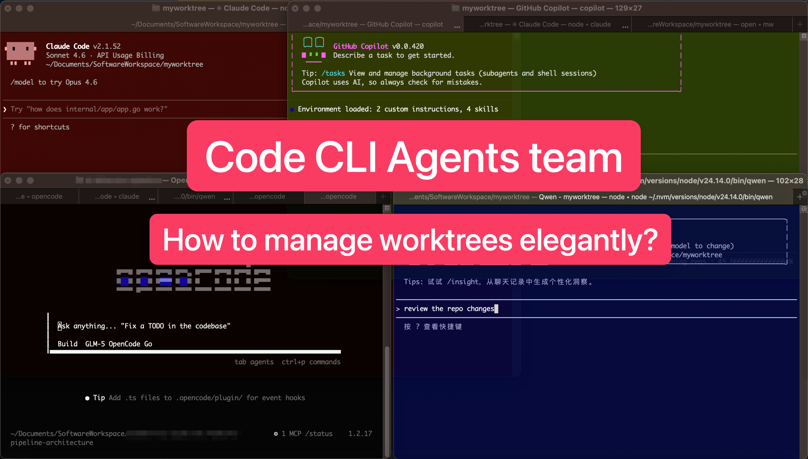
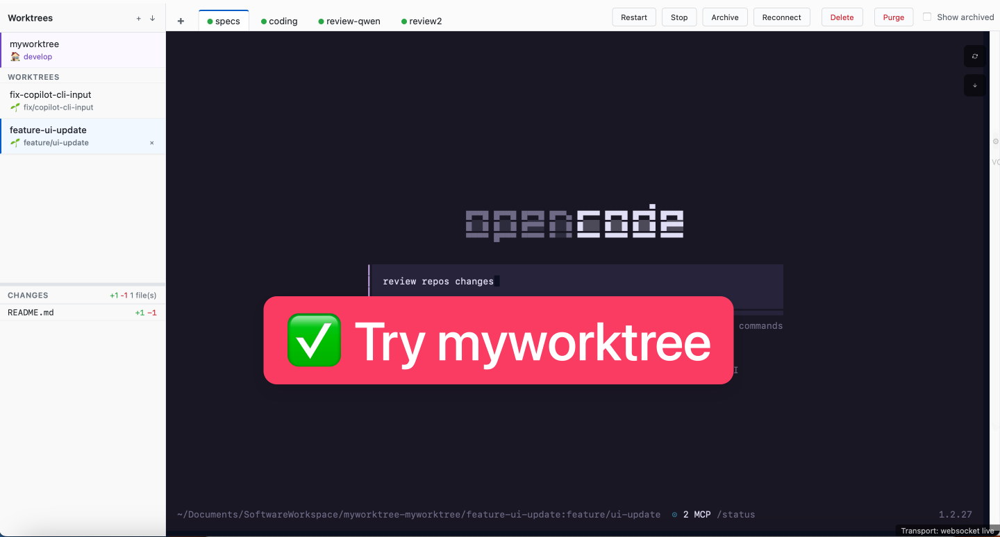

# myworktree

一个轻量的 agents team 管理工具：充分利用 **git worktree** 工作区独立特性，多样化 **coding CLI instance（长期运行进程）** 的能力，并提供最小可用 Web UI 与输出回放。

- English: [README.md](./README.md)
- 文档： [PRD](./docs/PRD.md) · [架构](./docs/ARCHITECTURE.md) · [API](./docs/API.md)





## 背景与痛点
当你在同一个项目里并行多个需求/修复（尤其需要多个 AI coding CLI 工具并行协作与互相审核）时，常见问题是：
- 一个工作目录被“半成品改动 + 依赖安装 + 临时脚本”污染，切换任务成本高
- 终端窗口越开越多：跑测试/构建/搜索/Review，不知道哪个还在跑、输出去哪了
- 关闭/刷新页面后，长时间运行的 CLI 进程容易中断，或无法找回之前输出

一个典型工作流可能是：GPT/GLM 起草文档，Claude/MiniMax 负责 coding 落地，Qwen 负责 review；要让这种分工高效运转，往往需要“按角色隔离工作区 + 长连接可重连的终端进程”。

## myworktree 的做法
myworktree 只做管理，不碰项目具体内容：
- 每个任务用 **git worktree** 给你一个隔离目录（通常对应独立分支）
- 在每个 worktree 下托管多个 **instance**，后端持续运行，可随时重连
- 提供最小 Web UI：统一查看、停止、以及**输出回放**
- 通过 **Tag** 模板（`command/env/preStart/cwd`）启动 instance，方便为不同类型工具准备环境

## 功能（MVP）
- 受管 worktree：创建/列表/纳入管理(import)/删除（严格删除：dirty 则拒绝）
- 受管 instance：基于 Tag 启动模板启动/停止/重启/列表
- instance 重启会保留 worktree、tag/命令，并串联旧/新实例记录
- 默认 WebSocket Web TTY 交互（并保留 SSE/HTTP 兜底）
- 前端页面关闭/刷新后：后端 instance 继续运行；重新打开可回放输出并继续交互
- UI 提供传输状态标记（websocket/sse/polling）和 WS 重连按钮
- 服务重启后会自动把历史残留的 `running` 记录回收到 `stopped`
- 可选内置 HTTPS（`--tls-cert/--tls-key`），非 loopback 监听必须 `--auth`
- 回放落盘日志脱敏（覆盖常见 secret 与 `sk-...`）
- MCP 接口（`/api/mcp/tools`、`/api/mcp/call`）
- Portal 仪表板：共享入口端口，跨仓库自动发现运行实例
- 全局认证 Token（HttpOnly Cookie、CSRF 防护、Tailscale Serve 自动集成）
- 侧栏主工作区项目名旁在仓库 remote 指向 `github.com` 时渲染 GitHub 图标；点击在新窗口打开 `https://github.com/<owner>/<repo>` 规范 URL。GitHub Enterprise 与非 GitHub remote 不展示。
- **Reasonix Web 聊天实例（MVP）** — 启动实例时勾选 *Reasonix (web chat UI)*，即可在该 worktree 中运行 `reasonix serve` 智能体，并通过 iframe 渲染其 Web 聊天界面（`/rx/<id>/`，同源反向代理，注入 token cookie 并重写 URL 前缀）。serve 使用你真实的 `~/.reasonix`（不做 per-instance 隔离）：会话/历史/配置/凭据按项目与终端运行的 `reasonix` 完全共享，同一项目的历史（含终端会话）可在内嵌侧栏中查看/切换。每次 Start 打开全新会话（无 `--resume`）；删除实例绝不触碰共享会话池。需要在 `PATH` 中提供 `reasonix` 二进制；该 MVP 有意保留 reasonix UI 侧栏（项目切换）。
- **PTY 日志改为内存环形缓冲** — 每个实例的 PTY 日志存放在有界的内存环形缓冲（默认每实例 32 MB、硬上限 256 MB、全局预算不超过系统内存的 25%）而不是磁盘日志文件，消除长时间 PTY 重负载会话的磁盘写放大。`LogBufferBytes` 可覆盖单实例上限；启动后若超出全局预算，接口返回 `503` 及结构化 `log_buffer_budget_exceeded` 响应体。
- **Changes 面板文件预览** — 点击任意已变更或未跟踪文件即可预览：带行号、格式化视图与差异视图（未跟踪文件提供合成 diff，已处理 `quotePath`）。
- **分支 divergence 徽标** — 侧栏在分支相对上游 ahead/behind 时显示分歧徽标，支持定时刷新。
- **`mw config regen` 与认证热加载** — 命令行重新生成配置；认证 token / 配置变更无需重启 daemon 即生效。
- **Tags 配置目录** — 可直接从 UI 打开 tags 配置目录，开箱自带合理的默认 tags。
- **daemon 资源监控** — 资源统计 API 现在把 mw daemon 进程本身计入全局合计，UI 中以独立行展示。

## 运行环境
- macOS 12+ 其他平台未验证
- `git`
- `zsh`
- `script`（用于托管可交互 shell）
- Go 工具链（构建用；Go 模块在编译时静态链接到二进制文件中，运行时无外部依赖）

## 快速开始

### 发布版使用

如果你只是想直接使用 `myworktree`，推荐从 GitHub Releases 下载已打包的发布版：

- Apple Silicon Mac：`myworktree_vX.Y.Z_darwin_arm64.tar.gz`
- Intel Mac：`myworktree_vX.Y.Z_darwin_amd64.tar.gz`
- 校验文件：`checksums.txt`

示例：

```bash
# 根据你的 Mac 机型选择对应压缩包，然后校验并解压
curl -LO https://github.com/linletian/myworktree/releases/download/v0.4.0/myworktree_v0.4.0_darwin_arm64.tar.gz
curl -LO https://github.com/linletian/myworktree/releases/download/v0.4.0/checksums.txt
shasum -a 256 -c checksums.txt --ignore-missing
tar -xzf myworktree_v0.4.0_darwin_arm64.tar.gz

# 可选：安装到 PATH
sudo install -m 755 ./mw /usr/local/bin/mw
sudo install -m 755 ./myworktree /usr/local/bin/myworktree

# 验证下载下来的二进制
mw --version
```

建议从 `v0.4.0` 或更新版本开始使用公开发布版二进制。更早的 `v0.1.0` GitHub Release 资产在补充实测中发现严重终端交互问题后已撤回，而 `v0.4.0` 是当前推荐的公开发布版本。

每个发布压缩包内都包含 `mw`、`myworktree`、`README.md`、`LICENSE` 和 `CHANGELOG.md`。
如果当前还没有预发布/正式发布压缩包，或者你的平台暂无对应产物，就直接使用下面的源码编译步骤。

**Apple Silicon 排障提示：** macOS 会对从网络下载的二进制文件施加隔离属性（Gatekeeper），可能导致二进制无响应或提示"无法验证开发者"。可运行：
```bash
xattr -d com.apple.quarantine ./mw ./myworktree
```
或在 **系统设置 → 隐私与安全性** 中为被阻止的二进制文件点击"仍要打开"。

### Build & install

```bash
构建（在 myworktree 源码仓库内）
cd /path/to/myworktree
go build -o myworktree ./cmd/myworktree

# 可选：构建别名命令 `mw`（等效于 `myworktree`）
#（`mw` 默认会自动打开浏览器；可用 `-open=false` 关闭）
go build -o mw ./cmd/mw
```

强烈建议将构建的命令安装到用户目录下(示例为 macOS)

```bash
# 可选：安装到 PATH（以下两种方式任选其一）
# A）用户级目录
# mkdir -p ~/bin
# mv /path/to/myworktree/myworktree ~/bin/myworktree
# mv /path/to/myworktree/mw ~/bin/mw
# B）系统级目录（通常默认就在 PATH 里）
# 注意：install 需要的是“已编译好的二进制文件”，不是 Go 源码目录（所以不要写 cmd/mw）。
# cd /path/to/myworktree && go build -o mw ./cmd/mw && go build -o myworktree ./cmd/myworktree
# sudo install -m 755 ./myworktree /usr/local/bin/myworktree
sudo install -m 755 ./mw /usr/local/bin/mw

# 替代方案：go install（安装到 GOBIN/GOPATH/bin）
# go install ./cmd/mw
# go install ./cmd/myworktree
```

查看当前构建版本信息：

```bash
myworktree --version
mw version
```

### Run

```bash
# 运行（进入你要管理的目标 git 仓库）
cd /path/to/target/git/repo

# 用绝对路径运行（无需配置 PATH）
# /path/to/myworktree/mw -listen 127.0.0.1:0


# -listen 是选填参数，端口号写 `0` 表示“自动选择并持久化一个与当前 repo 绑定的端口”。
# 同一 repo 后续启动会优先复用该端口（若端口可用）。
# myworktree 会输出完整 URL（包含实际端口）。
# /path/to/myworktree/myworktree -listen 127.0.0.1:0
# /path/to/myworktree/mw -listen 127.0.0.1:0
mw

# （可选）使用固定端口
# /path/to/myworktree/myworktree -listen 127.0.0.1:50053
# /path/to/myworktree/myworktree -open=true
```
运行成功后，`mw` 默认会自动打开浏览器访问对应 URL。
`myworktree` 默认只打印 URL；如果也想自动打开浏览器，可传 `-open=true`。

当 Portal 启用时，启动输出包含：
```
[portal] Portal dashboard at: http://0.0.0.0:12345/
[portal] Tailscale URL: https://my-machine.tail-scale.ts.net/
```

myworktree 会用**当前工作目录**定位目标项目（git root），并基于该 git root 计算独立的数据目录，因此要管理其他项目时，只需要在另一个项目仓库目录下运行同一个 myworktree 二进制即可。

默认情况下，新建 worktree 会放在主仓库的同级目录下：
`<repo父目录>/<repo目录名>-myworktree/<worktree名>/`。
如果你想切回旧行为（放在每个项目的数据目录下），用 `-worktrees-dir=data`；也可以把 `-worktrees-dir` 设置为自定义路径。

## 常用命令
```bash
# version
myworktree --version
mw version

# worktree
myworktree worktree new "修复登录 401 并补测试"
myworktree worktree list
myworktree worktree delete <worktreeId>

# tags
myworktree tag list

# instance
myworktree instance start --worktree <worktreeId> --tag <tagId>
myworktree instance start --worktree <worktreeId> --cmd "echo hello && ls"
myworktree instance start --worktree <worktreeId>  # 启动一个可交互 shell instance
myworktree instance list
myworktree instance stop <instanceId>

# config（全局认证 Token）
mw config              # 交互式引导（设置/查看/清除/重新生成 Token）
mw config set-auth     # 直接设置 Token
mw config get-auth     # 查看 Token（掩码显示）
mw config clear-auth   # 清除 Token
mw config regen        # 重新生成 Token（需确认）

# 启动并启用远程访问 + Portal
mw start --listen 0.0.0.0:0                     # LAN 访问，自动继承全局 Token
mw start --listen 0.0.0.0:0 --portal-port 12346 # 自定义 Portal 端口
mw start --listen 0.0.0.0:0 --portal-port 0     # 禁用 Portal
```

## Tag 配置

Tag 会从以下位置合并加载：
- 全局：`$(os.UserConfigDir())/myworktree/tags.json`
- 项目：`$(os.UserConfigDir())/myworktree/<repoHash>/tags.json`

示例：

```json
{
  "tags": [
    {
      "id": "backend-dev",
      "command": "npm run dev",
      "preStart": "npm install",
      "cwd": "apps/backend",
      "env": {
        "NODE_ENV": "development"
      }
    }
  ]
}
```

## 本地测试与 CI

建议在发起 PR 前先执行本地检查：

```bash
test -z "$(gofmt -l .)"
go test ./...
go build -o myworktree ./cmd/myworktree
go build -o mw ./cmd/mw
```

GitHub Actions（`.github/workflows/go-ci.yml`）会在以下场景运行：
- push 到 `develop` 和 `main`
- 目标分支为 `develop` 或 `main` 的 Pull Request（`opened`、`synchronize`、`reopened`、`ready_for_review`）

工作流会在 Ubuntu 和 macOS 上校验 `gofmt`、执行 `go test ./...`，并构建两个二进制。

带 `v*` 标签的发布会触发 `.github/workflows/release.yml`，产出 darwin `amd64` / `arm64` 压缩包和 SHA256 校验文件。

## 远程访问

### 全局 Token

一次性配置全局认证 Token，所有实例自动继承：

```bash
mw config
# → 交互式引导：[1] 设置 Token  [2] 查看 Token  [3] 清除 Token  [4] 重新生成 Token  [q] 退出
# Token 存储在 ~/.config/myworktree/auth.json（0600 权限）
```

当未提供 `--auth` 且 `auth.json` 中无已有 Token 时，CLI 会**自动生成一个随机的 32 字符 hex Token** 并持久化。这确保实例默认启用认证。实例级别 `--auth` 参数优先级高于全局 Token。

### Portal 仪表板

`mw start --listen 0.0.0.0:0` 会在端口 `12345` 启动 **Portal 仪表板**（可通过 `--portal-port` 自定义）。仪表板功能：

- 自动发现并列出所有跨仓库运行中的实例
- 点击实例直接跳转到其 Web UI（通过实例端口直连——Portal 反向代理 `/s/<repo-hash>/` 计划中但尚未实现）
- 使用 **HttpOnly Cookie**（`mw_token`）进行认证——Token 不出现在 URL 或 JS 中
- 登录/登出端点采用 **CSRF 防护**（double-submit cookie 模式）
- Cookie 具备 24 小时**滑动过期**机制（每次认证成功的请求自动刷新有效期）

设置 `--portal-port 0` 可禁用 Portal。

### Tailscale HTTPS

> **说明**：自动 `tailscale serve` 配置功能**当前已禁用**，原因是 macOS 上 Tailscale 1.98 CLI 存在 bug：`tailscale serve --bg` 返回成功但实际未配置代理。相关代码存在于 `internal/portal/portal.go` 中但未接入正式代码路径。用户仍可通过 Tailscale IP（`http://100.x.x.x:12345`）经 WireGuard 隧道安全访问 Portal。待 Tailscale 修复上游 bug 后将重新启用自动 `tailscale serve` 管理功能。

### 网络安全

| 访问路径 | 协议 | 加密层级 |
|----------|------|----------|
| 实例直连（本地/LAN IP） | `http://192.168.1.18:PORT` → 实例 | 无（仅 LAN 可及） |
| 实例直连（Tailscale IP） | `http://100.x.x.x:PORT` → 实例 | WireGuard 隧道加密 |
| 仪表板 + 代理（本地/LAN） | `http://host:12345` → 代理 `http://127.0.0.1:PORT` | 无（仅 LAN 可及） |
| 仪表板 + 代理（Tailscale IP） | `http://100.x.x.x:12345` → 代理 `http://127.0.0.1:PORT` | WireGuard 隧道加密 |
| `tailscale serve` 域名 | `https://machine.ts.net` → 代理 `http://127.0.0.1:PORT` | Let's Encrypt TLS + WireGuard |

> **说明**：Tailscale 的 WireGuard 隧道已对网络层加密。仅通过 `tailscale serve` 域名访问时使用应用层 HTTPS（Let's Encrypt 证书）。

## 已知限制

### Reasonix 实例与 `REASONIX_HOME`

Reasonix 实例运行 `reasonix serve` 时**不设置** `REASONIX_HOME`，嵌入式 web UI 直接使用你的真实 `~/.reasonix`——与终端里直接运行的 `reasonix` 完全一致。driver 会从宿主环境**剥离**继承的 `REASONIX_HOME` / `REASONIX_STATE_HOME`（并输出一条日志提示），确保实例与终端始终共享同一项目会话池；项目间隔离由 reasonix 自身按 cwd 完成。

需要留意的后果：如果你的 shell 导出了自定义 `REASONIX_HOME`（例如 `~/.custom-reasonix`），终端里运行的 reasonix 会使用该自定义 home，而 myworktree 实例使用默认 `~/.reasonix`——两者将**看不到彼此的**历史会话。这是刻意行为。如需让某个实例指向自定义 home，可在实例 tag 的 `env` 中设置 `REASONIX_HOME`（在剥离之后追加，后值生效）。

实例生命周期不会触碰共享会话池：Start / Stop / Restart / Delete 只管理 `serve` 子进程及其管理文件（实例状态目录下的 `token`/`port`/`pid`/`serve.log`）。会话存放在 `~/.reasonix/projects/<cwd-slug>/sessions`，因此重启实例会打开一个**全新会话**（无 `--resume`），而你的历史会话仍可在侧边栏切换。

## License
MIT 协议，详见 [LICENSE](./LICENSE)。
